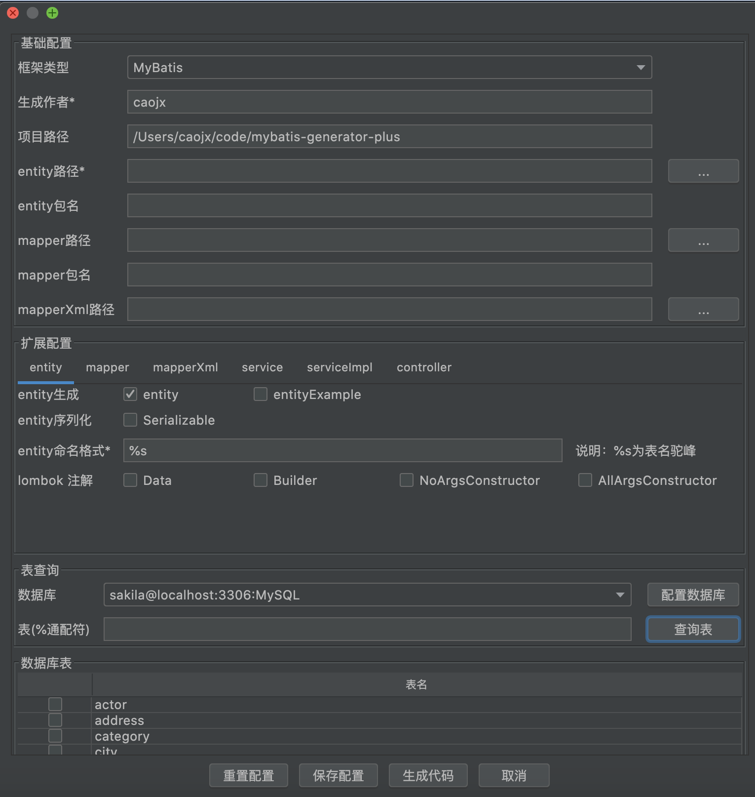

# idea-plugin-mybatis-generator

## 插件效果图
入口：idea顶部菜单->Tools->MyBatisCodeGenerator  

## 插件功能说明

- 支持IntelliJ IDEA 2019.3之后的版本
- 插件入口 Tools菜单->MyBatisCodeGenerator
- 支持MyBatis、TkMyBatis、MyBatisPlus 三种风格代码生成
- 支持定制化生成 entity、mapper、mapperXml、service、serviceImpl、Controller
- 目前只支持MySQL，可以添加多个数据库，后续会考虑支持更多的数据库
- 配置支持持久化，密码敏感数据存储在电脑本地的钥匙串中

## 常见问题
1. 持久化配置存储在项目的 .idea/mbg-plugin.xml 文件中，如果插件加载失败，可以尝试删除该文件

